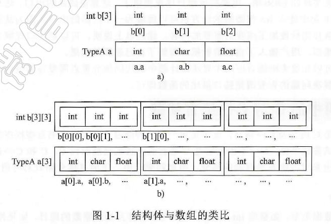

## 结构型

结构型可以理解为以基础数据类型为原料制作的数据类型。其实我们常用的数组也是自己制作的数据类型。数组是由多个相同数据类型的变量组合起来的，例如：

```c
int a[10];
```

该语句就定义了一个数组，名字为 a，就是将 10 个整型变量连续地摆在一起，其中各整型变量之间的位置关系通过数组下标来反映。

如果想制作一个数组，第一个变量是整型变量，第二个变量是字符型变量，第三个变量是浮点型变量，该怎么办呢？这时就用到结构体了。结构体就是制作新的数据类型的一种机制，即可以用系统已经有的不同的基本数据类型或用户定义的结构型，组合成用户需要的复杂数据类型。

```c
typedef struct {
    int a;
    char b;
    float c;
} TypeA;
```

上面的语句制造了一个新的数据类型，即 `TypeA` 型。`TypeA a;` 可以认为定义了一个数组，名字为 `a`，只不过组成 `a` 数组的 3 个分量是不同类型的。对于结构体 `a.a`、`a.b`、`a.c` 分别对应于结构体中第一、第二、第三个元素的值，与数组十分相似。

再看语句 `TypeA a[3];`，它定义了一个数组，由 3 个  `TypeA` 型的元素组成。前边已经定义 `TypeA` 为结构型，它含有 3 个分量，因此 `a` 数组中的每个元素都是结构型且每个元素都有 3 个分量，可以把它类比成一个二维数组。



## 指针型

对于其他类型的变量，变量里所装的是数据元素的内容，而指针型变量里装的是变量的地址，通过它可以找出这个变量在内存中的位置，就像一个指示方向的指针，指出了某个变量的位置，因此叫作指针型。

指针型的定义方法对每种数据类型都有特定的写法。对于每种变量，指针的定义方法有相似的规则 `数据类型 *变量名`，如以下语句：

```c
int *a;
char *b;
float *c;
TypeA *d;
```

如果 `a` 是个指针型变量，且它已经指向了一个变量 `b`，则 `a` 中存放变量 `b` 所在的地址。`*a` 就是取变量 `b` 的内容（`x=*a;` 等价于 `x=b;`），`&b` 就是取变量 `b` 的地址，语句 `a=&b;` 就是将变量 `b` 的地址存于 `a` 中即大家常说的指针 `a` 指向 `b`。

## 定义链表结点

链表结点有两个域：一个是数据域，用来存放数据；另一个是指针域，用来存放下一个结点的位置。

```c

```
