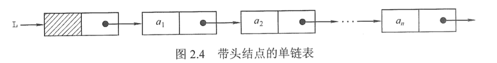
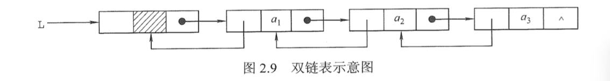
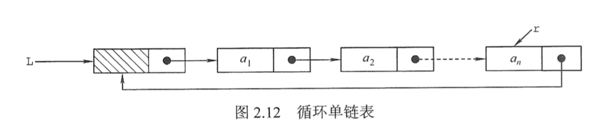
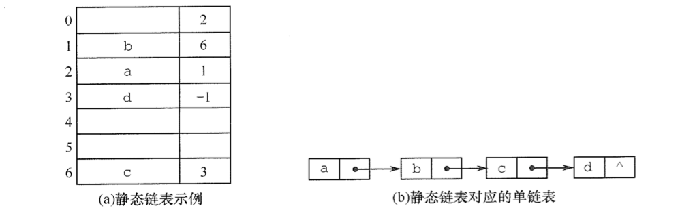

顺序表可以随时存取表中的任意一个元素，它的存储位置可以用一个简单直观的公式表示，但插入和删除操作需要移动大量元素。链式存储线性表时，不需要使用地址连续的存储单元，即不要求逻辑上相邻的元素在物理位置上也相邻，它通过“链”建立起数据元素之间的逻辑关系，因此插入和删除操作不需要移动元素，而只需修改指针，但也会失去顺序表可随机存取的优点。

## 单链表的定义

线性表的链式存储又称单链表，它是指通过一组任意的存储单元来存储线性表中的数据元素。为了建立数据元素之间的线性关系，对每个链表结点，除存放元素自身的信息外，还需要存放一个指向其后继的指针。

```c++
typedef int ElemType;

typedef struct LNode {
  ElemType data;      //数据域
  struct LNode *next; //指针域
} LNode;              //单链表结点类型

/*
 * 结构体名和类型名是可以相同的，因为两者的命名空间是不同的：
 * 结构体声明变量时必须加 struct 关键字，即 struct LNode *L;
 * 而类型声明变量时不需要加 struct 关键字，即 LNode *L;
 */
```

利用单链表可以解决顺序表需要大量连续存储单元的缺点，但单链表附加指针域，也存在浪费存储空间的缺点。由于单链表的元素离散地分布在存储空间中，所以单链表是非随机存取的存储结构，即不能直接找到表中某个特定的结点。查找某个特定的结点时，需要从表头开始遍历，依次查找。

通常用头指针来标识一个单链表，如单链表 L，头指针为 NULL 时表示一个空表。此外，为了操作上的方便，在单链表第一个结点之前附加一个结点，称为头结点。头结点的数据域可以不设任何信息，也可以记录表长等信息。头结点的指针域指向线性表的第一个元素结点，如图 2.4 所示。



头结点和头指针的区分：不管带不带头结点，头指针都始终指向链表的第一个结点，而头结点是带头结点的链表中的第一个结点，结点内通常不存储信息。引入头结点后，可以带来两个优点：

1. 由于第一个数据结点的位置被存放在头结点的指针域中，因此在链表的第一个位置上的操作和在表的其他位置上的操作一致，无须进行特殊处理。

2. 无论链表是否为空，其头指针都指向头结点的非空指针（空表中头结点的指针域为空），因此空表和非空表的处理也就得到了统一。

## 单链表上基本操作的实现

```c++
//初始化单链表
void InitList(LNode *&L) {
  L = new LNode; //创建头结点
  L->next = nullptr;
}

//在单链表L中插入值为e的结点
void InsertElem(LNode *L, ElemType e) {
  auto *p = new LNode; //创建新结点
  p->data = e;
  p->next = L->next; //插入到表头
  L->next = p;
}

//在单链表L中查找值为e的结点
LNode *LocateElem(LNode *L, ElemType e) {
  LNode *p = L->next; //p指向第一个结点
  while (p != nullptr && p->data != e)
    p = p->next;
  return p;
}


//在单链表L中删除值为e的结点
void DeleteElem(LNode *L, ElemType e) {
  LNode *p = L->next, *q; //p指向第一个结点
  while (p != nullptr && p->data != e) {
    q = p;
    p = p->next;
  }
  if (p != nullptr) {
    q->next = p->next;
    delete p;
  }
}

//输出单链表L中的所有结点
void PrintList(LNode *L) {
  LNode *p = L->next; //p指向第一个结点
  while (p != nullptr) {
    std::cout << p->data << " ";
    p = p->next;
  }
  std::cout << std::endl;
}
```

## 双链表

单链表结点中只有一个指向其后继的指针，使得单链表只能从头结点依次顺序地向后遍历。要访问某个结点的前驱结点（插入、删除操作时），只能从头开始遍历，访问后继结点的时间复杂度为 O(1)，访问前驱结点的时间复杂度为 O(n)。

为了克服单链表的上述缺点，引入了双链表，双链表结点中有两个指针 prior 和 next，分别指向其前驱结点和后继结点，如图 2.9 所示。


```c++
typedef struct DNode {
  ElemType data;      //数据域
  struct DNode *prior;//前驱指针域
  struct DNode *next; //后继指针域
} DNode;              //双链表结点类型
```

双链表在单链表的结点中增加了一个指向其前驱的 prior 指针，因此双链表中的按值查找和按位查找的操作与单链表的相同。但双链表在插入和删除操作的实现上，与单链表有着较大的不同。

```c++
// 双链表的插入操作
bool InsertDLinkList(DNode *&L, int i, ElemType e) {
  DNode *p = L, *s;
  int j = 0;
  while (p && j < i - 1) {
    p = p->next;
    j++;
  }
  if (!p || j > i - 1) {
    return false;
  }
  s = new DNode;
  s->data = e;
  s->next = p->next;
  if (p->next) {
    p->next->prior = s;
  }
  s->prior = p;
  p->next = s;
  return true;
}

// 双链表的删除操作
bool DeleteDLinkList(DNode *&L, int i, ElemType &e) {
  DNode *p = L, *q;
  int j = 0;
  while (p && j < i - 1) {
    p = p->next;
    j++;
  }
  if (!p || j > i - 1) {
    return false;
  }
  q = p->next;
  if (!q) {
    return false;
  }
  e = q->data;
  p->next = q->next;
  if (q->next) {
    q->next->prior = p;
  }
  delete q;
  return true;
}
```

## 循环链表

### 循环单链表

循环单链表和单链表的区别在于，表中最后一个结点的指针不是 NULL，而改为指向头结点，从而整个链表形成一个环，如图 2.12 所示。

在循环单链表中，表尾结点* r 的 next 域指向 L，故表中没有指针域为 NULL 的结点，因此，循环单链表的判空条件不是头结点的指针是否为空，而是它是否等于头指针。



循环单链表的插入、删除算法与单链表的几乎一样，所不同的是若操作是在表尾进行，则执行的操作不同，以让单链表继续保持循环的性质。当然，正是因为循环单链表是一个“环”，因此在任何一个位置上的插入和删除操作都是等价的，无须判断是否是表尾。

### 循环双链表

在循环双链表中，头结点的 prior 指针还要指向表尾结点。

## 静态链表

静态链表借助数组来描述线性表的链式存储结构，结点也有数据域 data 和指针域 next，与前面所讲的链表中的指针不同的是，这里的指针是结点的相对地址（数组下标），又称游标。和顺序表一样，静态链表也要预先分配一块连续的内存空间。

静态链表和单链表的对应关系如图 2.14 所示。



```c++
#define MAXSIZE 1000

typedef struct {
  ElemType data;
  int next;
} SLinkList[MAXSIZE];
```

静态链表以 next==-1 作为其结束的标志。静态链表的插入、删除操作与动态链表的相同，只需要修改指针，而不需要移动元素。

```c++

```
