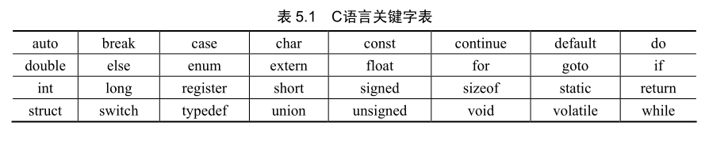

## 基本程序结构

```c++
#include <stdio.h>

#define PI 3.14

float area(float r) {
    float s;
    s = PI * r * r;
    return s;
}


int main() {
    float r, s;
    printf("radius=");
    scanf("%f", &r);
    s = area(r);
    printf("area=%f\n", s);
    return 0;
}
```

C 语言程序为函数模块结构，所有的 C 语言程序都是由一个或多个函数构成。C 语言程序的函数可分为编译器提供的标准函数和由用户自己定义的函数。C 语言提供了大量的标准函数，标准函数被放在后缀为 h 的头文件中，例如可以引入 `math.h`，用其中计算平方值的函数修改求圆形面积函数的表达式。修改后的源代码如下：

```c++
float area(float r) {
    float s;
    s = PI * pow(r, 2);
    return s;
}
```

### 函数库和链接

程序员通常不需要从头开始设计每一个函数，完全用 C 语言命令所实现的函数非常罕见。因为所有的 C 语言编译器都提供能完成各种常见任务的函数，如 printf 函数等。C 语言编译器的实现者已经编写了大部分常见的通用函数，这些函数根据其意义分类，分别放在头文件中。如 stdio.h 头文件存放的是输入输出相关的函数，math.h 头文件存放的是数学计算函数。

函数的集合称之为函数库，遵守 ANSI C 标准的编译器所提供函数组成的函数库称之为 ANSI C 标准函数库。编写程序时用到的函数许多都可以在标准函数库中找到，它们是可以简单地组合起来的程序构件。编写了一个经常要用的函数之后，也可将其放入自定义的库中备用编译器编译源代码时以函数为单位进行编译，并记忆函数的名字。随后，编译器以源文件中的顺序去查找函数间的关系，并且在可执行文件内部实现函数间的可访问性，该过程称之为“链接”。因此，如果某一个函数要调用另一个函数，被调用的函数必须在前面定义。最简单的解决办法就是使用函数原型，在创建函数前，首先将函数原型定义在头文件中。

### C 语言的关键字


