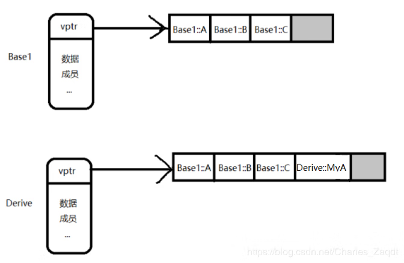
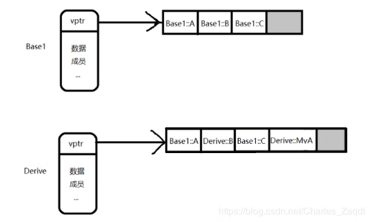
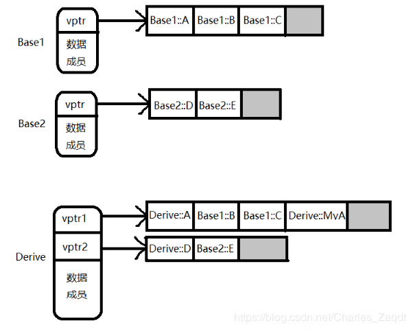

在编程语言和类型论中，多态（polymorphism）指为不同数据类型的实体提供统一的接口，或使用一个单一的符号来表示多个不同的类型。

多态的最常见主要类别有：

- 特设多态：为个体的特定类型的任意集合定义一个共同接口。
- 参数多态：指定一个或多个类型不靠名字而是靠可以标识任何类型的抽象符号。
- 子类型（也叫做子类型多态或包含多态）：一个名字指称很多不同的类的实例，这些类有某个共同的超类。

## 虚函数与虚函数表

对于一个类来说，**如果类中存在虚函数，那么该类的大小就会多4个字节，然而这4个字节就是一个指针的大小，这个指针指向虚函数表**。所以，如果对象存在虚函数，那么编译器就会生成一个指向虚函数表的指针，所有的虚函数都存在于这个表中，**虚函数表就可以理解为一个数组，每个单元用来存放虚函数的地址**。

**虚函数（Virtual Function）是通过一张虚函数表来实现的**。简称为V-Table。在这个表中，主要是一个类的虚函数的地址表，**这张表解决了继承、覆盖的问题，保证其真实反应实际的函数**。这样，在有虚函数的类的实例中分配了指向这个表的指针的内存，所以，当用父类的指针来操作一个子类的时候，这张虚函数表就显得尤为重要了，它就像一个地图一样，**指明了实际所应该调用的函数**。 

## 虚函数表存在的位置

```c++
#include <iostream>

class A {
public:
  int x = 0;
  virtual void y() { std::cout << "A::y" << std::endl; }
};

int main() {
  A *a = new A();

  std::cout << a << std::endl;
  std::cout << &a->x << std::endl;

  return 0;
}
```

如果对象的地址和 x 的地址相同，那么就意味着编译器把虚函数表放在了末尾，如果两个地址不同，那么就意味着虚函数表是放在最前面的。

可以观察到结果是不同的，而且正好相差了 4 个字节，由此可见，编译器把生成的虚函数表放在了最前面。

> 32 位编译器是 4 个字节，64 位编译器是 8 个字节。
> 以下的代码只在 32 位下有效，64 位编译器则必须将 long 改为 long long。

## 获取虚函数表

既然虚函数表是真实存在的，那么我们能不能想办法获取到虚函数表呢？其实我们可以通过指针的形式去获得，因为前面也提到了，我们可以把虚函数表看作是一个数组，每一个单元用来存放虚函数的地址，那么当调用的时候可以直接通过指针去调用所需要的函数就行了。我们就类比这个思路，去获取一下虚函数表。

```c++
#include <iostream>

using namespace std;

class Base {
public:
  virtual void a() { cout << "Base a()" << endl; }
  virtual void b() { cout << "Base b()" << endl; }
  virtual void c() { cout << "Base c()" << endl; }
};

class Derive : public Base {
public:
  virtual void b() { cout << "Derive b()" << endl; }
};

int main() {
  cout << "-----------Base------------" << endl;
  auto *base = new Base;
  long *tmp1 = (long*)base;
  long *vptr1 = (long*)(*tmp1);
  for (int i = 0; i < 3; i++) {
    cout << "vptr[" << i << "] : " << vptr1[i] << endl;
  }

cout << "-----------Derive------------" << endl;
  auto *derive = new Derive;
  long *tmp2 = (long *) derive;
  long *vptr2 = (long *) (*tmp2);
    for (int i = 0; i < 3; i++) {
        cout << "vptr[" << i << "] : " << vptr2[i] << endl;
    }

  return 0;
}
```

如果用 64 位编译器则必须改为 long long。

用 32 位编译器运行：

```
-----------Base------------
vptr[0] : 4204208
vptr[1] : 4204368
vptr[2] : 4204528
-----------Derive------------
vptr[0] : 4204208
vptr[1] : 4204688
vptr[2] : 4204528
```

可见基类中的三个指针分别指向 a,b,c 虚函数，而派生类中的三个指针中第一个和第三个和基类中的相同，那么这就印证了上述我们所假设的情况，那么这也就是虚函数表。

但是仅仅只是观察指向的地址，还不是让我们观察的特别清楚，那么我们就通过定义函数指针，来调用一下这几个地址，看看结果是什么样的，下面直接上代码：

```c++
#include <iostream>

using namespace std;

class Base {
public:
  virtual void a() { cout << "Base a()" << endl; }
  virtual void b() { cout << "Base b()" << endl; }
  virtual void c() { cout << "Base c()" << endl; }
};

class Derive : public Base {
public:
  virtual void b() { cout << "Derive b()" << endl; }
};

typedef void (*Func)();

int main() {
  cout << "-----------Base------------" << endl;
  auto *base = new Base;
  long *tmp1 = (long *) base;
  long *vptr1 = (long *) (*tmp1);
  for (int i = 0; i < 3; i++) {
    cout << "vptr[" << i << "] : " << vptr1[i] << endl;
  }

  Func a = (Func) vptr1[0];
  Func b = (Func) vptr1[1];
  Func c = (Func) vptr1[2];

  a();
  b();
  c();

  cout << "-----------Derive------------" << endl;
  auto *derive = new Derive;
  long *tmp2 = (long *) derive;
  long *vptr2 = (long *) (*tmp2);
  for (int i = 0; i < 3; i++) {
    cout << "vptr[" << i << "] : " << vptr2[i] << endl;
  }

  Func d = (Func) vptr2[0];
  Func e = (Func) vptr2[1];
  Func f = (Func) vptr2[2];
  d();
  e();
  f();

  return 0;
}
```

```
-----------Base------------
vptr[0] : 4204208
vptr[1] : 4204368
vptr[2] : 4204528
Base a()
Base b()
Base c()
-----------Derive------------
vptr[0] : 4204208
vptr[1] : 4204688
vptr[2] : 4204528
Base a()
Derive b()
Base c()
```

这样就清晰的印证了上述所说的假设，那么虚函数表就获取出来了。

## 多重继承的虚函数表

虚函数的引入其实就是为了实现多态，现在来研究一下多重继承的虚函数表是什么样的，首先我们先来看一下简单的一般继承的代码：

```c++
class Base1 {
public:
	virtual void A() { cout << "Base1 A()" << endl; }
	virtual void B() { cout << "Base1 B()" << endl; }
	virtual void C() { cout << "Base1 C()" << endl; }
};

class Derive : public Base1{
public:
	virtual void MyA() { cout << "Derive MyA()" << endl; }
};
```

这是一个类继承一个类，这段代码如果我们通过派生类去调用基类的函数，应该结果可想而知，这里就不再演示和赘述了。我们来分析这两个类的虚函数表，对于基类的虚函数表其实和上面所说的虚函数表是一样的，有自己的虚函数指针，并指向自己的虚函数表，重点是在于派生类的虚函数表是什么样子的，它的样子如下图所示：



那么**Derive 的虚函数表就是继承了 Base1 的虚函数表，然后自己的虚函数放在后面，因此这个虚函数表的顺序就是基类的虚函数表中的虚函数的顺序+自己的虚函数的顺序**。那么我们现在在 Derive 中再添加一个虚函数，让它覆盖基类中的虚函数，代码如下：

```c++
class Base1 {
public:
	virtual void A() { cout << "Base1 A()" << endl; }
	virtual void B() { cout << "Base1 B()" << endl; }
	virtual void C() { cout << "Base1 C()" << endl; }
};

class Derive : public Base1{
public:
	virtual void MyA() { cout << "Derive MyA()" << endl; }
	virtual void B() { cout << "Derive B()" << endl; }
};
```

那么对于这种情况的虚函数表如下图所示：



这个是单继承的情况，然后我们看看多重继承，也就是 Derive 类继承两个基类，先看一下代码：

```c++
class Base1 {
public:
	virtual void A() { cout << "Base1 A()" << endl; }
	virtual void B() { cout << "Base1 B()" << endl; }
	virtual void C() { cout << "Base1 C()" << endl; }
};

class Base2 {
public:
	virtual void D() { cout << "Base2 D()" << endl; }
	virtual void E() { cout << "Base2 E()" << endl; }
};

class Derive : public Base1, public Base2{
public:
	virtual void A() { cout << "Derive A()" << endl; }           // 覆盖Base1::A()
	virtual void D() { cout << "Derive D()" << endl; }           // 覆盖Base2::D()
	virtual void MyA() { cout << "Derive MyA()" << endl; }
};
```

这个是单继承的情况，然后我们看看多重继承，也就是 Derive 类继承两个基类，先看一下代码：

```c++
class Base1 {
public:
	virtual void A() { cout << "Base1 A()" << endl; }
	virtual void B() { cout << "Base1 B()" << endl; }
	virtual void C() { cout << "Base1 C()" << endl; }
};

class Base2 {
public:
	virtual void D() { cout << "Base2 D()" << endl; }
	virtual void E() { cout << "Base2 E()" << endl; }
};

class Derive : public Base1, public Base2{
public:
	virtual void A() { cout << "Derive A()" << endl; }           // 覆盖Base1::A()
	virtual void D() { cout << "Derive D()" << endl; }           // 覆盖Base2::D()
	virtual void MyA() { cout << "Derive MyA()" << endl; }
};
```

首先我们明确一个概念，对于多重继承的派生类来说，它含有多个虚函数指针，对于上述代码而言，Derive 含有两个虚函数指针，所以它不是只有一个虚函数表，然后把所有的虚函数都塞到这一个表中，为了印证这一点，我们下面会印证这一点，首先我们先来看看这个多重继承的图示：



由图可以看出，在第一个虚函数表中首先继承了 Base1 的虚函数表，然后将自己的虚函数放在后面，对于第二个虚函数表中，继承了 Base2 的虚函数表，由于在 Derive 类中有一个虚函数 D 覆盖了 Base2 的虚函数，所以第一个表中就没有 Derive::D 的函数地址。

## 虚函数特点

1. 每一个基类都会有自己的虚函数表，派生类的虚函数表的数量根据继承的基类的数量来定。
2. 派生类的虚函数表的顺序，和继承时的顺序相同。
3. 派生类自己的虚函数放在第一个虚函数表的后面，顺序也是和定义时顺序相同。
4. 对于派生类如果要覆盖父类中的虚函数，那么会在虚函数表中代替其位置。

## 虚函数指针和虚函数表的创建时机

对于**虚函数表**来说，在**编译的过程中**编译器就为含有虚函数的类创建了虚函数表，并且编译器会在构造函数中插入一段代码，这段代码用来给虚函数指针赋值。因此虚函数表是在编译的过程中创建。

对于**虚函数指针**来说，由于虚函数指针是基于对象的，所以对象在**实例化的时候**，虚函数指针就会创建，所以是在**运行时创建**。由于在实例化对象的时候会调用到构造函数，所以就会执行虚函数指针的赋值代码，从而将虚函数表的地址赋值给虚函数指针。

```c++

```
