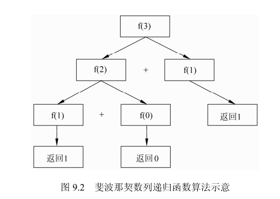
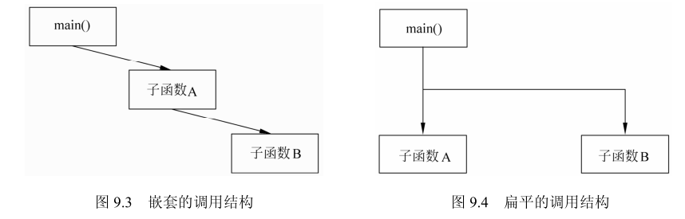
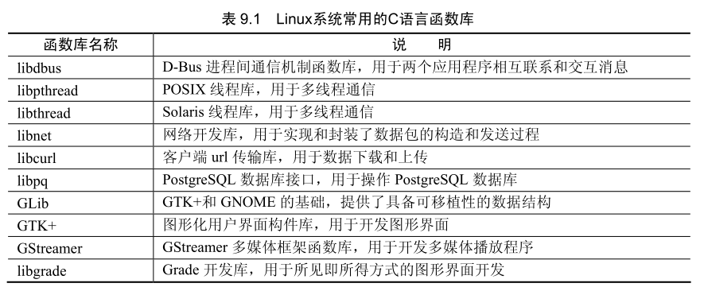

## 函数说明与返回值

函数由类型说明符、函数名、参数表、参数说明段和函数体 5 个部分组成。类型说明符定义了函数的返回值，即 return 语句所返回给调用者的数据类型。函数名是每个函数的唯一名称，函数命名规则与变量相同。参数表和参数说明段是函数的外部接口，函数调用时通过参数将值传递给函数体内，参数表是具体接口的个数，参数说明段是参数的数据类型定义。函数体是实现函数功能的代码块，需要用一对大括号将其包围，return 语句放置在函数体内。main 函数具备同样的结构。

函数的一般形式如下：

```c++
类型说明符 函数名(参数表)
参数说明段
{
    函数体
}
```

### 函数的类型说明

函数的类型说明符可以是任何数据类型，包括空值型 void，即不使用 return 语句返回任何数据。默认情况下，函数被自动说明为整型。函数必须在第一次调用前定义，这样编译器才能找到该函数。或者将函数的类型说明放在首次调用之前，前置函数类型说明被称为函数原型。

### 返回语句

函数的返回语句 return 有两个作用：其一，结束当前函数，调用者获得程序控制权。其二，将计算结果传递给调用者。函数的结束有两种情况，一是函数体内所有的代码执行完毕，二是 return 语句被执行。

## 函数的作用域规则

作用域规则是指代码或数据的有效使用范围。C 语言将函数作为独立的代码块，函数之间不能相互访问其内部的代码或数据。函数间数据的传递只能通过接口实现。但是，变量的定义方法可改变函数的作用域规则，可将变量分为局部变量和全局变量两种。

### 局部变量

在函数体内部定义的变量称为局部变量，局部变量的作用域仅限于该函数体内。声明局部变量的关键字为 auto，它的一般形式是：

```c++
auto 数据类型 变量名;
```

auto 关键字作为声明语句的默认值，所以通常可省略。在函数中定义的局部变量，作用域在该函数体内。

### 全局变量

全局变量的作用域为整个源程序文件，文件中的所有函数或程序块都可以引用。当定义全局变量时，需将变量的声明语句放置在所有函数外。

全局变量虽然能方便地在程序的各个函数间传递数据，但同时也破坏了模块的独立性和完整性，所以应尽量避免使用全局变量。

### 动态存储变量

从变量的生存周期来分类，可将变量分为动态存储变量和静态存储变量。动态存储变量在函数调用时放入内存，函数调用后从内存中删除。声明动态存储变量的关键字为auto与声明局部变量相同，它的一般形式是：

```c++
auto 数据类型 变量名;
```

auto关键字作为声明语句的默认值，所以通常可省略。由于函数中的动态变量会在函数退出时删除，所以两次调用函数时，函数不会保存动态变量的数据。

还有一种动态存储变量称之为寄存器变量。寄存器是位于CPU内部的存储单元，CPU读取寄存器内的数据极其快捷。因此，将程序中需要大量反复使用的变量设为寄存器变量，可提高程序的运行速度。声明寄存器变量的一般形式为：

```c++
register 数据类型 变量名;
```

寄存器资源非常有限。不同的操作系统和 C 语言编译器对寄存器变量的使用有不同的限制。如 GCC 编译器通常限制寄存器变量的数量为 2 个，将超过的寄存器变量当作普通动态变量处理。

### 静态存储变量

在编译时分配存储空间的变量称为静态存储变量。在函数退岀时，静态存储变量依然被保留在内存中，再次执行同一函数会得到与上次退出时相同的数值。声明静态存储变量的关键字为 static。声明的一般形式为：

```c++
static 数据类型 变量名;
```

```c++
#include <stdio.h>

void func() {
    static int x = 100;
    printf("%d\n", x);
    x += 100;
}

int main() {
    func();
    func();
    func();

    return 0;
}
```

声明赋值语句只执行一次。

## 函数的调用与参数

函数通过调用获得程序的控制权，函数的参数是调用者与函数的数据接口。函数可以定义一个或多个参数，也可以省略参数，调用时将与参数的数据类型相匹配的数据置于参数列表中，即可在函数体内使用。参数的调用有多种形式，对函数的影响也有不同的结果。

### 形式参数与实际参数

形式参数是接口数据的目的地。实际参数是接口数据的来源地。函数定义时出现在参数列表中的参数是形式参数，函数体可通过引用形式参数获得接口数据。函数调用时填入的参数是实际参数，实际参数由调用者提供。形式参数与实际参数的数据类型必须一致，同时还需要注意实际参数的个数和位置要与形式参数相同。

### 赋值调用与引用调用

赋值调用与引用调用是传递数据给函数的两种形式，前者是将实际参数的数值传递给形式参数，后者是将实际参数的内存地址传递给形式参数。赋值调用不会改变实际参数原有的数值，而引用调用则可能改变实际参数的数值。使用引用调用时，参数的类型需设置为指针，如下列源代码所示：

```c++
#include <stdio.h>

void func(int a, int *b) {
    a = 199;
    *b = 299;
}

int main() {
    int a = 0, b = 0;

    printf("a=%d, b=%d\n", a, b);

    func(a, &b);
    printf("a=%d, b=%d\n", a, b);

    return 0;
}
```

## 递归

递归函数是能够直接或通过另一个函数间接调用自身的函数。调用自身的方法称为递归调用。递归调用的本质是使用同一算法将复杂的问题不断化简，直到该问题解决。

```c++
#include <stdio.h>

long fibonacci(long n) {
    if (n == 0 || n == 1) return n;
    return fibonacci(n - 1) + fibonacci(n - 2);
}

int main() {
    setbuf(stdout, NULL);

    long n;

    for (n = 0; n < 30; n++) {
        printf("fibonacci(%ld) = %ld\n", n, fibonacci(n));
    }

    return 0;
}
```



## 实现问题

在设计函数时需要遵循一些基本原则，因为这影响到函数的执行效率和可用性。函数是代码复用的基础，一个健壮的函数和由多个函数组成的函数集可以在多个程序中使用。

C语言标准库里所存放的就是这样的函数。这些函数被放置在头文件中，使用时将它包含在程序内即可。

### 参数和通用函数

通用函数是指能够复用的函数。这一类函数的显著特点是，只使用参数作为接口传递数据。如果一个函数中依赖全局变量访问调用者的数据，在另一个程序中环境改变了，这个函数就无法运行。因此，不应该把函数建立在全局变量上，函数所需要的所有数据都应从参数获得。使用参数传递数据除了有助于函数的复用以外，还能提高代码的可读性。

程序测试是程序设计中的一个重要步骤。在C语言程序设计中，模块测试是针对函数的测试方法。将函数独立于程序外，模拟调用者的所需要传递的各种数据和程序运行时的不同状态，借助GDB等调试工具检验函数体内的代码是否正常运行，以及函数所返回的结构是否符合预期，是一种常用的模块测试方法。函数只有在通过严格的模块测试后，才能成为通用函数。

### 效率

函数是 C 语言的基本构件，所有的程序都是由函数组成。C 语言程序执行的入口是 main 函数，当 main 函数调用子函数时，操作系统为子函数在内存中建立一种称为栈的数据结构，将主函数的返回地址和子函数的局部变量保存在栈中。如果子函数再调用另个子函数，那么依旧是遵循上述原则。

**建立栈数据结构的系统开销比较大**，所以会影响程序执行效率，特别是在一个函数反复嵌套调用时，如递归调用，函数的调用结构应趋向于扁平的结构。

例如，主函数调用子函数 A 结束后，再调用子函数 B，如图 9.4 所示。



### 函数库

函数库由一系列函数说明文件和函数定义文件所组成，使用时将该文件包含在自己的程序文件内。例如，需要使用输入输出函数时，可使用标准库内的 stdio.h 文件，需要使用数学函数时，可使用标准库内的 math.h 文件。

Linux 系统上有大量的函数库资源。根据 GPL 协议，这些函数库都能免费使用，并且可按照自己的需求修改。很多 Linux 系统上的程序发布时，同时也提供了相应的函数库以便开发者扩展该程序，或者借助该程序实现新程序中某一功能。例如 Pidgin 是 Linux 系统上常用的多协议即时通信软件，用户可使用 Pidgin 提供的 libpurple 开发新的即时通信软件，或者让自己的程序具备即时通信功能。Linux 系统常用的 C 语言函数库参见表 9.1。



Linux 系统一般将函数库放置在“/usr/include”路径中，GCC 编译器在编译时会自动搜索这个路径。在位于默认搜索路径之外的函数库，可在环境变量 LD_LIBRARY_PATH 中指明库的搜索路径，或者在 “/etc/ld.so.conf” 文件中添加库的搜索路径。另外，还可以直接将库文件全部复制到程序开发目录中，或者在编译时指定函数库路径。

pkg-config 程序为配置函数库的路径提供了方便，它用于在编译时指定函数库的路径。
首先需要安装该软件，安装命令如下：

```c++
apt install pkg-config -y
```

pkg-config 可查看已安装的函数库和函数库的版本信息，命令为

```c++
pkg-config --list-all
```

## main 函数的参数

main 函数有两个参数，它的形式是：

```c++
main(int argc，char*argv[])
```

argc 的数据类型为整型，argv 的数据类型为字符型指针数组。有些程序在终端运行时输入完程序文件名后可加上一些额外的运行参数，main 函数的参数即是用来向程序传递这些运行参数的入口。argc 参数用于记录运行参数的个数，argv 参数用于保存运行参数。

所输入的程序名也是运行参数，所以不输入其他运行参数的情况下，也会被捕获到一个运行参数。如下列源代码：

```c++
#include <stdio.h>

int main(int argc, char *argv[]) {
    int i;

    printf("argc: %d\n", argc);

    for (i = 0; i < argc; i++) {
        puts(argv[i]);
    }

    return 0;
}
```
