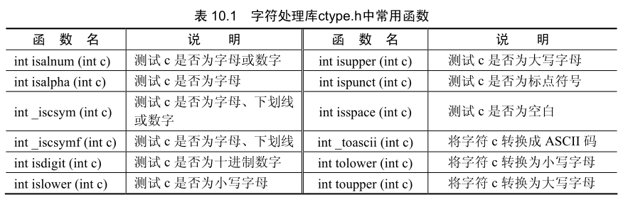
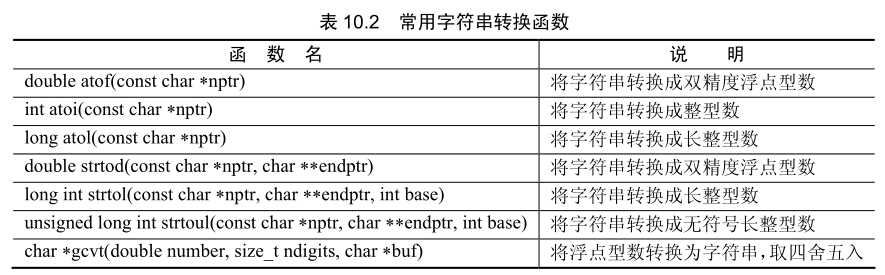
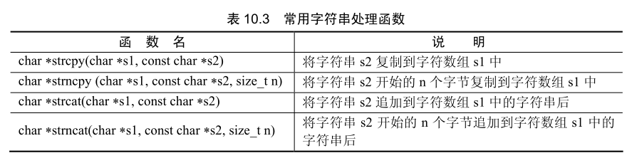
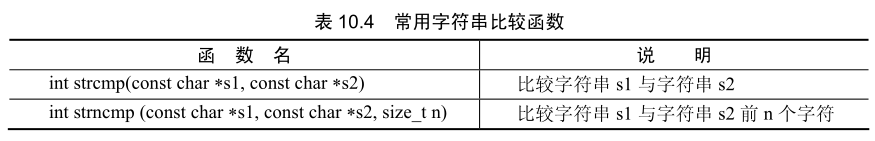
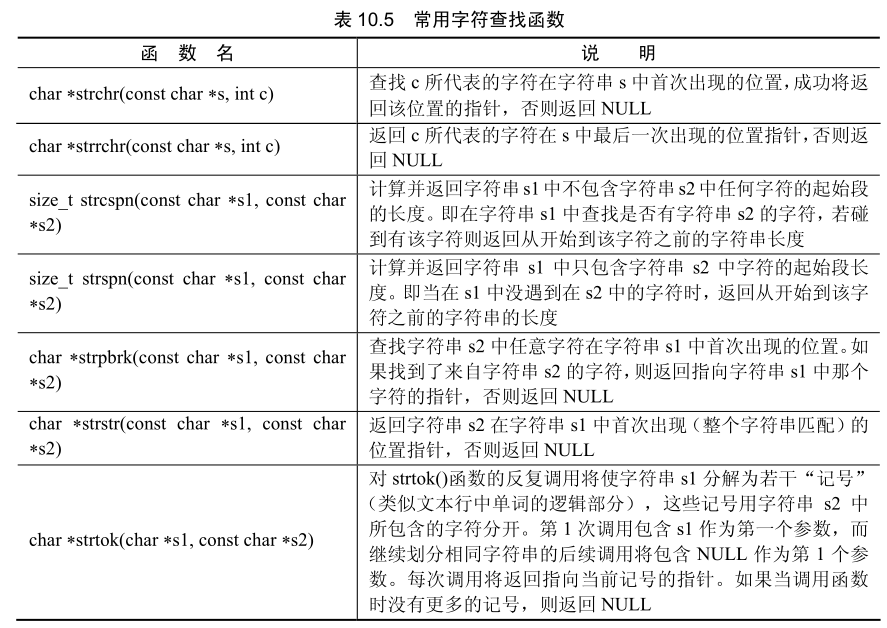
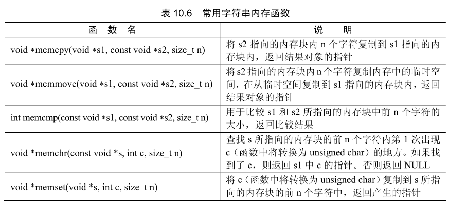
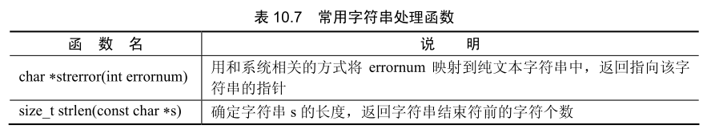

## 字符编码

最早的字符编码是布莱叶发明的盲文体系。他用凸凹不平的点所组成的阵列来表示字符，使盲人能够阅读和书写。计算机受限于逻辑电路，并不能直接识别和表示字符，早期的计算机科学家受布莱叶盲文的启示，使用有规则的二进制序列代表字符，于是形成了计算机字符编码体系。

### ASCII 编码

ASCII 编码的全称是美国信息交换标准编码。它是当前最流行的计算机字符编码系统之一。

### Unicode编码

Unicode 编码是 ASCII 码的升级体系，这种编码使用 2 个、4 个或更多字节的存储空间，已建立了 10 万字符的全球通用字符集。Linux 系统中以 UTF-8 标准的 Unicode 编码作为系统的内码，每个字符的存储空间为 2 字节，但同时也能兼容 ASCII 码的单字节体系。在 Linux 系统上开发程序时，应考虑双字节编码的问题，尽量不使用字符型变量接受系统传入的字符型数据，以及使字符型数组的长度保持为偶数。

## 字符处理库

字符处理库 `ctype.h` 包含一系列对 ASCII 编码字符数据进行测试和处理的函数。每个函数接受一个整型数据作为参数，或者用文件结束符 EOF 作为参数。ASCI 编码字符通常是 1 字节的整数，因此字符通常作为整数来处理。文件结束符的值是-1，一些硬件体系结构并不允许在 char 变量中存储负值。因此，字符处理函数将字符作为整数来处理。表 10.1列举了字符处理库中常用的函数。

## 字符串转换函数

在设计程序时，有时需要将字符串所代表的数字转换为其他类型的数值，或者将其他类型的数值转换为用字符串表示的数据。实用函数库 stdlib.h 提供了这一类函数，见表10.2。

## 字符串处理函数

字符串处理库 string.h为处理字符串数据、比较字符串、在字符串中查找字符和其他字符串、标记字符串（将字符串划分成逻辑段）和确定字符串长度提供了常用的函数，见表10.3。

除 strncpy 函数以外，这几个函数都会将数组s1后未用到的数组元素置为0。s1必须有足够的空间储存字符串s2或追加字符串s2。

## 字符串比较函数

字符存储形式为正整数，所以可比较两个字符之间的大小。字符串比较是将两个字符串位置相对应的字符逐个比对，比较两个字符串之间的大小。字符串比较函数对判断两个字符串中内容是否相同和对字符串排序非常有用。常用的字符串比较函数见表10.4。

两个函数的返回值都为整型，比较的结果相等时返回0。如果s1小于s2，返回负数值，如果sl小于s2，返回整数值。

字符串 s1 等于 s2，s1 与 s2 前 6 个字符比较也相等，因为两个字符串中每个字符都是相同的。字符串之间大于或小于的意义实际上是比较两个字符串中第一个不相同的字符，s1 大于 s3，strcmp(s1, s3) 返回的结果为 1。这两个字符串的第 7 个字符分别是 N 和 H，N 的 ASCII 码值大于 H，所以字符串 s1 大于 s3。因此，字符串比较函数在排序时非常有用，因为 ASCII 编码内字母的顺序与英文字母表的顺序相同。

## 字符串查找函数

字符串处理库提供了在字符串中找到相同的字符或子字符串的函数，以及将字符串分组的函数。常用的字符串查找函数见表10.5。

## 字符串内存函数

字符串处理库提供了内存函数，这些函数将内存块作为字符数组处理，能复制、比较和查找内存块。表10.6列出了字符串处理库中的内存函数。

## 字符串的其他函数

字符串处理库其余的两个函数是 strerror 和 strlen sterror 函数能从编译器获得错误代码的文本描述，使程序的错误能够获得直观的解答。strlen 函数的作用是返回一个字符串的长度，该长度是从字符串首地址到字符串结束符之间的字符距离，见表10.7。

