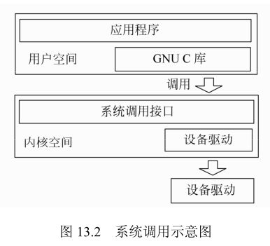
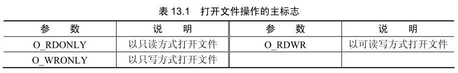
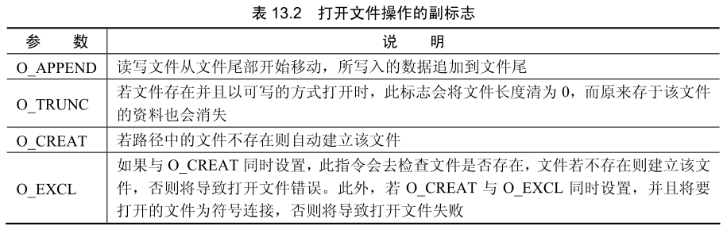
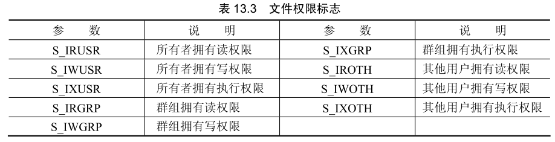
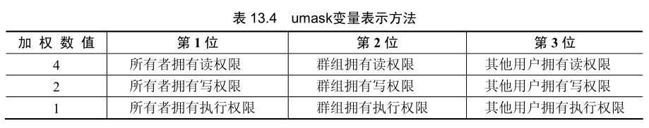
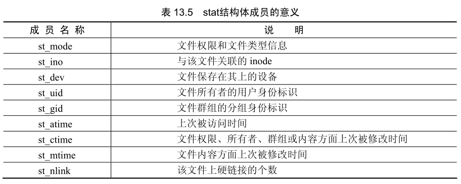
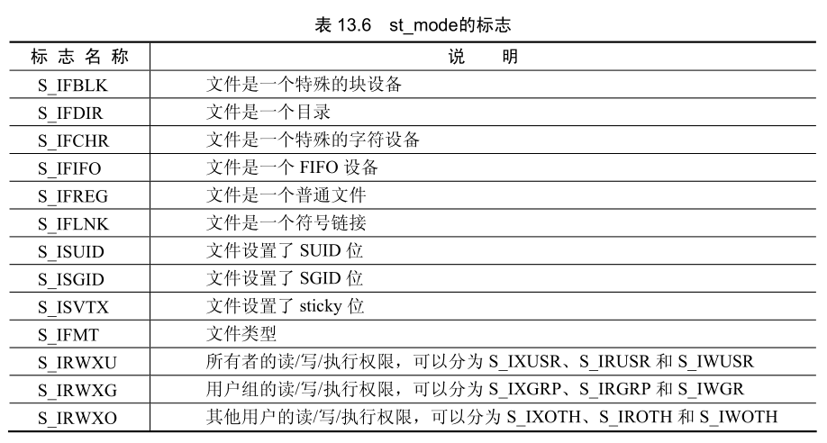
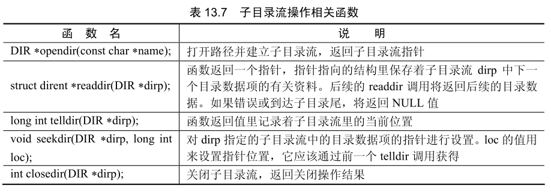

 
在 Linux 系统中开发 C 语言程序所涉及的文件操作与其他平台有很大差别。Linux 系统对目录和文件有极其严格的保护，只有获得相关权限的用户才能进行指定的操作。在本书的前面章节中提到过，进程是处于活动状态的程序，某个用户通过操作系统运行程序所产生的进程代表着该用户的行为。如果用户不具备访问某个目录和文件的权限，那么该用户的进程也不能被访问。

## 文件的属性与权限

文件的属性与权限是 Linux系统中目录和文件的两个基本特性，所有的目录和文件都具备这两种特性，它们决定了文件的使用方法与安全性问题。在 Linux系统中，目录也是一种特殊的文件，并能够将其作为文件使用，这与直观获得对目录的体验并不一样。另外Linux系统还有多种文件类型，例如设备文件、管道文件和链接文件，它们是文件概念的泛化。本节将介绍文件的属性与权限相关的知识。

### 文件的属性

Linux 系统中的文件安全机制是通过给系统中的文件赋予两个属性来实现的，这两个属性分别是所有者属性和访问权限属性。Linux 系统下的每一个文件必须严格地属于一个用户和个组，针对不同的用户和组又具有不同的访问权限。对于多用户操作系统来说，这种机制是保障每一个用户数据安全的必要手段。

## 文件管理

C 语言的文件管理功能有 3 种常用的实现途径。

第 1 种途径是直接进行文件系统的底层操作，这种方法需要程序员熟悉文件系统的结构，并编写大量的代码完成。

第 2 种途径是通过调用 shell 程序实现，C 语言提供了访问 shell 程序的接口，但 shel 的返回信息不便于在程序中进行分析。

第 3 种途径是借助系统调用实现，这种方式使 C 语言能够通过很少的代码完成相应的功能，并且可获得足够的反馈信息。

### 系统调用的原理

文件操作必须通过物理存储设备的驱动程序访问驱动器，如硬盘、光盘驱动器的驱动程序，这些驱动程序都存放在 Linux 的内核中。Linux 系统的核心部分即 Linux 内核，是一系列设备的驱动程序。系统调用是 Linux 内核提供的功能十分强大的一系列的函数。这些函数是在内核中实现的，它们是应用程序和内核交互的接口，如图 13.2 所示。系统调用在 Linux 系统中发挥着巨大的作用，如果没有系统调用，那么应用程序就失去了内核的支持。



系统调用并非 ANSI C 标准，所以不同的操作系统或不同 Linux 内核版本的系统调用函数可能不同。在预定义语句中包含系统调用函数库需要在头文件前加上相对路径 sys。

### 打开文件、新建文件和关闭文件操作

打开文件操作使用系统调用函数 open，该函数的作用是建立一个文件描述符，其他的函数可以通过文件描述符对指定文件进行读取与写入的操作。打开文件的一般形式是：

```c++
open(文件路径, 标志);
```

函数的返回值是文件描述符，如果打开文件成功返回一个正整数，否则返回-1。标志是用于指定打开文件操作模式的枚举常量，主标志见表13.1。



主标志是互斥的，使用其中一种则不能再使用另外一种。除了主标志以外，还有副标志可与它们配合使用，副标志可同时使用多个，使用时在主标志和副标志之间加入按位与
(|)运算符，见表13.2。



新建文件操作是在打开文件操作的函数上加入 O CREAT副标志实现的。当路径中的文件不存在时，则创建一个新文件。创建新文件的同时可设置文件的权限，这时函数需要增加一组实际参数，形式为：

```c++
open(文件路径, 标志, 权限标志);
```

文件权限标志见表13.3。



文件权限标志也可以使用加权数字表示，这组数字被称为 umask变量，它的类型是mode t，是一个无符号八进制数。umask变量的定义方法如表13.4所示。umask变量由3位数字组成，数字的每一位代表一类权限。用户所获得的权限是加权数值的总和。例如764表示所有者拥有读、写和执行权限，群组拥有读和写权限，其他用户拥有读权限。



新建文件的另一个函数是 creat，该函数的一般形式是：

```c++
creat(路径，umask)；
```

当文件被成功创建函数的返回值为0，否则为-1。当文件不需要使用了，则可以使用closed函数关闭文件。关闭文件的一般形式为 close(文件描述符)，如果关闭文件成功，closet函数返回0，否则返回-1。

下例将演示打开文件、新建文件和关闭文件这3种操作。程序的逻辑为：指定一个路径，如果该文件存在，输出提示信息，关闭该文件；如果该文件不存在，则新建文件并设置文件属性，输出提示信息，然后关闭该文件。完整的代码如下：

```c++
#include <sys/types.h>
#include <sys/stat.h>
#include <fcntl.h>
#include <stdio.h>
#include <unistd.h>

int main() {
    int f;
    const char *f_path = "test";
    mode_t f_attrib;

    f_attrib = S_IRUSR | S_IWUSR | S_IRGRP | S_IWGRP | S_IROTH;

    f = open(f_path, O_RDONLY);

    if (f == -1) {
        f = open(f_path, O_RDWR | O_CREAT, f_attrib);
        if (f != -1) {
            printf("create a new file %s", f_path);
        } else {
            printf("create failed %s", f_path);
            return 1;
        }
    } else {
        printf("open success %s", f_path);
    }

    close(f);

    return 0;
}
```

该程序首先判断是否存在文件 test，判断的方法是用 open 函数打开 test 文件，如果返回值是 -1，则表示该文件不存在(有时候并非如此)。当文件不存在时，使用 open 函数创建该文件，并在程序最后关闭。为 `mode_t` 型变量 `f_attrib` 赋值的方法使用了按位计算操作，将表示文件权限的常量进行按位或计算，计算的结果与八进制数 `0664` 相同。

### 文件状态和属性操作

获取文件状态和属性操作可使用 fstat、Istat 和 stat 这 3 个函数来操作。fstat 函数用来返回一个已打开文件的状态和属性信息，Istat 和 stat 函数可对未打开文件进行操作。Istat 和 stat 函数的区别是当文件是一个符号链接时，Istat 返回的是该符号链接本身的信息；而 stat 返回的是该链接指向的文件的信息。它们的一般形式为：

```c++
fstat(文件标识符, struct stat*buf)；
lstat(路径, struct stat*buf)；
stat(路径, struct stat*buf)；
```

其中结构体 struct stat类型是 stat h函数库提供的一种用于保存文件类型的结构体。该结构体成员的意义见表13.5。



其中，st_mode 与其他成员相比要复杂许多，必须使用标志与之进行按位与运算才能获得相应信息。与前面按位或运算比较可得知，按位与运算其实只是按位或运算的逆操作 st_mode 的标志见表 13.6。



修改文件权限的系统调用函数是 chmod，它与 shell 中的命令 chmod 作用相似。chmod 的一般形式是：chmod(路径, umask)。如果修改成功返回值为 0，否则返回 -1。


```c++
#include <sys/types.h>
#include <sys/stat.h>
#include <fcntl.h>
#include <stdio.h>
#include <unistd.h>
#include <stdlib.h>

int main() {
    int f;
    const char *f_path = "test";
    mode_t f_attrib;

    f_attrib = S_IRUSR | S_IWUSR | S_IRGRP | S_IWGRP | S_IROTH;

    f = open(f_path, O_RDONLY);

    if (f == -1) {
        f = open(f_path, O_RDWR | O_CREAT, f_attrib);
        if (f != -1) {
            printf("create a new file %s\n", f_path);
        } else {
            printf("create failed %s\n", f_path);
            return 1;
        }
    } else {
        printf("open success %s\n", f_path);
    }

    struct stat *buf = malloc(sizeof(stat));
    fstat(f, buf);
    if (buf->st_mode&S_IRUSR) printf("read\n");
    if (buf->st_mode&S_IRGRP) printf("write\n");

    close(f);
    chmod(f_path, 0771);
    fstat(f, buf);
    if (buf->st_mode&S_IRUSR) printf("read\n");
    if (buf->st_mode&S_IRGRP) printf("write\n");

    return 0;
}
```

### 目录操作

新建目录操作可使用函数 mkdir 实现，该函数的一般形式是：

```c++
mkdir(路径, umask)
```

当目录被成功创建函数的返回值为0，否则为-1。

获得当前工作目录的操作可使用函数 getcwd，该函数的一般形式是：

```c++
getcwd(char*buf, size t size);
```
 
其中，* buf 是存放当前目录的缓冲区，size 是缓冲区的大小。如果函数返回当前目录的字符串长度超过 size 规定的大小，它将返回 NULL。

执行程序的工作目录就是当前子目录，如果要改变执行程序的工作目录，可以使用函数chdir。这个函数的作用如同 shell里的cd命令一样，它的一般形式是：

```
chdir(路径);
```

另一个常用目录操作是扫描子目录，与此相关的函数被封装在头文件 dirent.h 里。它们使用一个名为 DIR 的结构作为子目录处理的基础，这个结构的指针所指向的内存空间被称之为子目录流。与子目录流操作相关的函数见表 13.7。



下例将设计一个可遍历子目录中所有文件的函数，用于演示目录操作及目录流操作相关函数的使用方法。代码如下：

```c++
#include <fcntl.h>// open
#include <unistd.h>
#include <stdio.h>
#include <dirent.h>//目录流操作
#include <string.h>
#include <sys/types.h>// mode_t 类型
#include <sys/stat.h>// 属性操作
#include <stdlib.h>

//定义目录扫描函数
void scan_dir(char *dir, int depth) {
    DIR *dp;//定义子目录流指针
    struct dirent *entry;//定义 dirent结构指针保存后续目录
    struct stat statbuf;//定义 statue结构保存文件属性
    if ((dp = opendir(dir)) == NULL) {//打开目录，获得子目录流指针，判断操作
        puts("open dir failed");
        return;
    }
    chdir(dir);//切换到当前目录中去获取下一级
    while ((entry = readdir(dp)) != NULL) {//目录信息，如果未结束则循环
        lstat(entry->d_name, &statbuf);//获取下一级成员属性
        if (S_IFDIR & statbuf.st_mode) {//判断下一级成员是否是目录
            if (strcmp(".", entry->d_name) == 0 || strcmp("..", entry->d_name) == 0) continue;
            printf("%*s%s/\n", depth, "", entry->d_name);//输出目录名称
            scan_dir(entry->d_name, depth + 4);//递归调用自身，扫描下一级目录的内容
        } else {
            printf("%*s%s/\n", depth, "", entry->d_name);//输出非目录名称
        }
    }

    chdir("..");
    closedir(dp);
}

int main() {
    scan_dir("/root", 0);
    return 0;
}
```

### 删除目录或文件操作

删除目录操作可使用函数 mairo完成。该函数的一般形式是：rmdir（路径）。该函数必须是在该目录下没有子目录或文件的情况下才能运行。删除文件操作可使用函数 unlink（路径）。

```c++
#include <fcntl.h>// open
#include <unistd.h>
#include <stdio.h>
#include <sys/stat.h>// 属性操作


int main() {
    if (mkdir("testdir", 0774) != -1) {
        puts("create dir success");
    } else {
        return 1;
    }

    if (rmdir("testdir") != -1) {
        puts("delete dir success");
    } else {
        return 1;
    }

    if (creat("test1", 0664) != -1) {
        puts("create file success");
    } else {
        return 1;
    }

    if (unlink("test1") != -1) {
        puts("delete file success");
    } else {
        return 1;
    }


    return 0;
}
```

如上例所示，很多软件中实现的临时文件就是通过这种方式创建的。在程序运行时创建文件，在程序结束前删除文件。但这并不是最好的选择，因为如果程序意外终止会留下无法清理的文件。在Linux系统中创建临时文件可使用 mkstemp 函数，该函数的一般形式是：

```c++
mkstemp(文件名XXXXXX);
```

mkstemp 函数会以可读写模式和 0600 权限来打开该文件，如果该文件不存在则会建立该文件。打开该文件后其文件描述符会返回，如果文件打开或创建失败则返回 NULL 需要注意的是，文件名必须是用字符串“XXXXXX”结尾。

### 错误处理

在进行文件操作的过程中可能会因各种原因而失败，错误信息将以代码的形式保存在系统变量 errno 中。很多函数通过改变 errno 变量的值输出标准错误信息编码，这些错误信息被保存在头文件 ermo.h 内。

进行错误处理的函数有两个：一个是 sterror 函数，该函数的作用是根据标准错误信息编码在映射表中査询相关字符串，并将该字符串的指针返回给调用者。另一个是 perror 函数，该函数内部已经调用了 sterror 函数，它的作用是将标准错误信息字符串输出到终端上，并为其增加一个说明。例如下例：

```c++
perror("文件操作"); // 如果收到错误信息，则输出
```

将该语句放在文件操作函数失败时执行的代码块中，那么它就能输出错误信息。例如无法打开一个文件，它的输出结果是：

```
文件操作：No such file or directory
```

因为很多函数都是用 ermo 变量，当另一个函数操作完成后可能会改变该变量的值。所以要获得正确的错误信息，应该将取得 errno 变量值的语句或 sterror 函数放在例子出错语句最近的位置。
