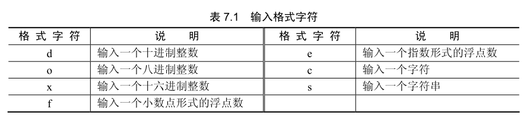

程序设计是一个问题求解的过程，其解决问题的步骤即可看作是程序的控制结构。简单地说，程序的运行过程就是数据输入、数据处理和数据输出3个步骤。

## 程序的 3 种基本结构

任何复杂的程序都离不开 3 种基本结构，分别是顺序结构、选择结构和循环结构。顺序结构是最基本的结构，程序语句依次顺序执行，所有的程序都包含有顺序结构；选择结构是一种根据条件来判断如何执行的逻辑结构，程序根据指定的条件来判断是否执行下面的语句；循环结构是反复执行一系列指令的逻辑结构，通常与选择结构配合使用，用以控制循环的次数。这 3 种结构相互组合，构成了丰富多彩的程序逻辑。

C 语言中，有一组相关的控制语句用以实现选择结构与循环结构。

- 选择控制语句：if、switch 和 case
- 循环控制语句：for、while 和 do while
- 转移控制语句：break、continue 和 goto。

## 数据的输入与输出

在程序的运行过程中，通常需要用户输入一些数据，而程序运算所得到的计算结果等又需要输岀给用户，由此实现人与计算机之间的交互。所以在程序设计中，输入输出语句是一类必不可少的重要语句。在 C 语言中，没有专门的输入输出语句，所有的输入输岀操作都是通过对标准输入输出库函数的调用实现。

### scanf()

格式化输入函数 scanf 功能是取得从键盘上输入的数据，所获得的数据按指定输入格式被赋给相应的输入项。该函数一般形式为

```c++
scanf("控制字符串"，输入项列表)
```

其中，控制字符串规定数据的输入格式，必须用双引号括起，其内容是由格式说明和普通字符两部分组成。输入项列表则由一个或多个变量地址组成，当变量地址有多个时，各变量地址之间用逗号“，”分隔。

scanf 函数输入项列表中各变量要加取地址操作符，就是变量名前加“&”，只有这样函数才能改变其值。输入类型与变量类型应尽量一致，以避免类型不匹配而造成的错误。

控制字符串有两个组成部分——格式说明和普通字符。格式说明规定了输入项中的变量以何种类型的数据格式被输入，形式是：

```c++
%<修饰符>格式字符
```

修饰符是可选的，用以表示输入字段宽度、约定整数是短整型还是长整型、是否屏蔽输入的数据。格式字符用以约定输入数据的数据类型，如表7.1所示。


如果需要输入一个十进制长整型数据，且规定字段宽度为 9 位有效数字，可用下面的代码完成。

```c++
long a;
scanf("%9ld", &a);
```

程序运行时，会要求在终端上输入数据，输入后按 enter 键，程序继续运行。假如输入的数据是 1234567890，那么前 9 位数字将作为有效的输入，变量 a 保存的数值为 123456789。在需要屏蔽输入的某个数据时，可使用修饰符“*”，如下列源代码所示。

```c++
char c1, c2, c3;
scanf("%c%*c%c", &c1, &c2, &c3); // c2 被屏蔽
```

当输入的数据为 abc 时，变量 cl 中保存的字符型数据为 a，变量 c3 保存的数据为 c 变量 c2 没有保存任何数据，仍然是未赋值状态。

控制字符串的普通字符主要是用作多个数据间的分隔，或者表示某种特定的输入格式。例如，通常用空格或者逗号来表示多个数据之间的分隔，如下列源代码所示。

```c++
int a, b, c;
scanf("%d, %d, %d", &a, &b, &c);
```

控制字符串中，3 个输入格式说明被用逗号隔开，所以如果要为变量正确赋值，输入时必须遵循这种格式，如输入 12，15，18。假若输入的数据是 12 15 18，数据间用空格分隔，那么就与规定的格式不符，上例中只有第一个变量能被正确赋值。另外，像换行符、制表符这样的转义字符也可以被用作输入数据间的分隔。

### printf()



用负号做修饰符，则可规定字段宽度在大于变量实际长度时，输出数据的对齐方式为左对齐，默认右对齐。

### getchar() putchar()

getchar 函数的作用是从终端获得一个字符。putchar 函数的作用是向终端输出一个字符。与前面介绍的两个输入输出函数不同的是，getchar 与 putchar 函数每次只能操作个 ASCII 代码。因此，在设计基于文本界面的简单应用程序时，常利用这一特性实现菜单选择的输入和用户确认的输入。

getchar 没有任何参数，使用方法是直接返回一个字符。putchar 是用一个字符型数据作为参数，执行时直接将该字符型数据输出到终端上。

## 条件控制语句

### if 语句

```c++
if () {

}
else if () {

}
else {

}
```

### switch 语句

```c++
switch () {
    case 1: break;
    case 2: break;
    default: break;
}
```

switch 语句会依次执行每个满足条件的 case 子语句，当一个 case 子语句条件满足后，如果希望终止 switch 语句的执行，可加入 break 命令。break 命令执行后，其后的 case 子语句和 default 子语句都将被跳过。default 子语句是默认执行条件，如果没有 case 子语句满足条件，或者执行的 case 子语句没有使用 break 命令终止 switch 语句执行，则 default 相关联的代码被执行。

switch 语句可嵌套使用，与 i 语句一样需要注意每组语句的对应关系。另外，case 子语句必须用常量表达式作为条件，否则会造成语法错误。

## 循环控制语句

### while 语句

### do-while 语句

与 while 语句的区别是，while 是先判断条件表达式再执行循环体，而 do-while 语句是先执行循环体再判断条件表达式。也就是说，do-while 语句会首先将循环体执行一次，再判断是否应该结束循环。

### for 语句

for 语句适用于可预知执行次数的循环控制结构。

```c++
for (int i=0; i<10; i++){

}
```

### break continue 语句

如果需要在循环体的执行过程中结束某一轮循环，或者直接跳岀循环，可使用 break 或 continue 语句。

break 语句的作用是立即结束当前循环并跳出循环体。
