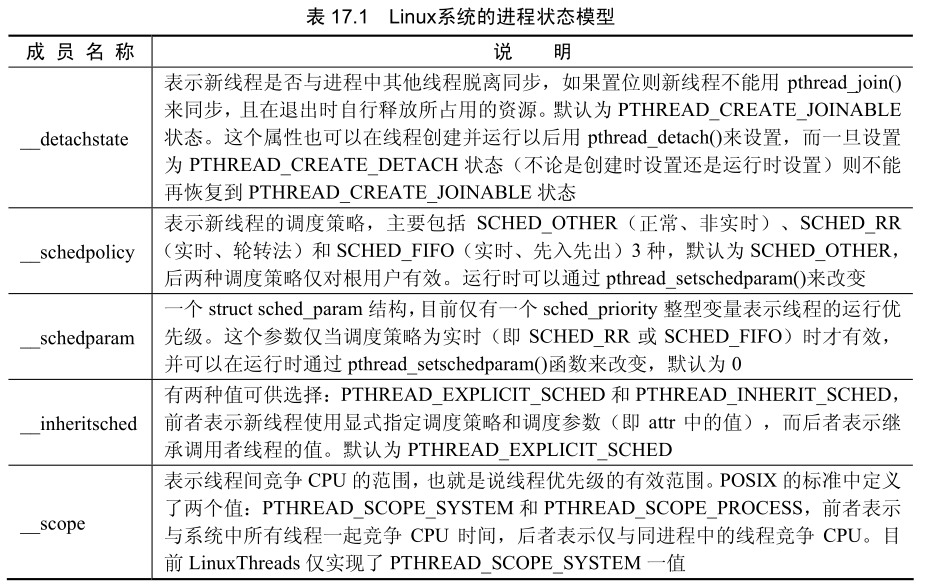

进程是操作系统中资源管理的最小单位，是程序执行的最小单位。在操作系统的设计上，从进程演化出线程的最主要目的就是更好地支持多处理器及减少上下文切换开销。线程和进程十分相似，不同的只是线程比进程小。一个进程至少需要一个线程作为它的指令执行体，进程管理着计算机资源，而将线程分配到某个 CPU 上执行。

## 线程的基本概念

线程是在共享内存空间中并发的多道执行路径，它们共享一个进程的资源，如文件描述符和信号处理。操作系统在两个进程间进行切换时，要对前一个进程进行保护现场操作，对后一个进程进行还原现场操作。反复进行上下文切换会带来极大的系统开销，CPU 必须为此分配一定的时钟周期。线程则无须进行上下文切换，因为多个线程共享同一个进程的上下文。多个线程也共享同一个进程的 CPU 时钟周期，进程的状态并未因线程切换而改变。

Linux 系统中曾经出现过多种线程标准，但是所有的标准都统一为 IEEE 制定的可移植操作系统接口标准 POSIX。目前，最为广泛使用的是 Pthread 线程标准，它更接近于执行体的概念。同一进程的线程可共享同一个 u 区和上下文，但也能拥有自身的堆栈空间和独立的执行序列。Pthread 线程与轻量级进程（LWP）相似，可以使进程同时执行多个任务。

在实际应用中，很多程序都是基于多线程的。例如网页浏览器，为了加快从网络上读取文件的速度，通常会启用多个线程分别读取文件的不同位置，最后将数据合并在一起。即时通信软件也会使用到多线程概念，否则无法同时与多人进行通信。

## 线程的实现

早期 Linux 系统中的线程是通过 fork 系统调用实现的，这种线程即为轻量级进程。它的缺陷是最多只允许同时创建 4095 个线程或进程。之后逐渐形成了新的线程模型 NPTL(Native POSIX Threading Library)。

在 Linux 系统的发展中，线程或进程数量的限 NPIL 与 POSIX 标准保持了兼容性，其创建、启动和链接开销都非常低，并且提供了良好的软硬件扩展能力。对于运行负荷繁重的线程应用，以及多路处理器、多核处理器而言，NPTL 线程性能提高显著。除此以外，NPTL 引入了线程组、线程独立的本地存储区等概念，在多线程和内存管理机制上也进行了大量改进。

### 用户态线程

用户态线程是由进程负责调度管理、高度抽象化的、与硬件平台无关的线程机制。其最为显著的标志是，进程在创建多个线程时不需要 Linux 内核支持，也不直接对 CPU 标志寄存器进行操作。用户态的优势在于下面两个方面。

- 减少多线程的系统开销：进程下的线程进行调度切换时，不需要进行系统调用同一个进程可创建的线程数没有限制。
- 用户态实现方式灵活：可根据实际需要设计相应的用户态线程机制，对于实时性要求高的程序格外重要。

但是，如果某进程的其中一个线程被阻塞，则进程会进入睡眠状态，其他线程同时也被阻塞。造成该现象的原因是 Linux 内核使用异步输入输岀机制。用户态的缺陷是，无法发挥多路处理器和多核处理器的优势。

### 内核态线程

内核态线程是由 Linux 操作系统根据 CPU 硬件的特点，以硬件底层模式实现的线程机制。内核态将所有线程按照同一调度算法调度，更有利于发挥多路处理器和多核处理器所支持的并发处理特性。内核态线程可自由访问内存空间，并且在某一线程阻塞时，其他线程还能正常运行。但是，相对于用户态线程，内核态线程的系统开销稍大，并且必须通过系统调用实现，对硬件和 Linux 内核版本的依赖性较髙，不利于程序移植。

## POSIX线程库

Pthread 线程对应的函数库为 libpthread，是目前 Linux 系统上最常用的线程库。它支持 NPTL 线程模型，以用户态线程实现。该函数库的接口被定义在 pthread.h 头文件中。

### 创建线程

创建线程可通过函数 pthread_create 实现。线程没有独立的 PID 等信息，无法直观地证明已创建成功。pthread_create 函数的一般形式是

```c++
int pthread_create(pthread_t *thread, pthread_attr_t *attr, void *(*start_routine)(void *), void *arg);
```

其中，第 1 个参数 ` * thread` 是一个 `pthread_t` 结构的指针，该结构用于保存线程的信息，函数创建线程成功时，将线程的标识符等信息写入 ` * thread` 指针所指向的内存空间。

第 2 个参数 ` * attr` 是一个 `pthread_attr_t` 结构指针，结构中的元素分别对应着新线程的运行属性，属性的定义见表 17.1。在没有特殊的属性要求时，可将 NULL 作为参数传递。



第 3 个参数表示需要传递的是 start_routine 函数的地址，该函数以一个指向 void 的指针为参数，返回的也是指向 void 的指针，这种方式使任何类型的数据都能作为参数，也能返回给任何类型的数据结构。start_routine 函数的作用是启动线程。第 4 个参数是 start_routine 函数的参数。

pthread_create 在创建线程成功时返回 0，在失败时返回一个错误代码。需要注意的是，与 Pthread 相关的函数在错误时都不会返回 -1。

### 结束线程

线程结束时可调用函数 pthread_exit，该函数的原理与结束进程的 exit 系统调用相似。

它的作用是结束调用了这个函数的线程，返回一个指向某个变量的指针。这个指针绝对不能是局部变量的指针，因为局部变量会在线程岀现严重问题时消失。pthread_exit 函数的般形式是：

```c++
void pthread_exit(void *retval);
```

如果进程需要在线程结束后与其归并到一起，可使用函数 pthread_join 实现，该函数的原理与进程同步的 wait 系统调用相同。pthread_join 函数的一般形式是：

```c++
int pthread_join(pthread_t th, void **thread_return);
```

第 1 个参数用于指定要等待的线程，该参数即是 pthread_create 函数定义的标识符。

第 2 个参数是一个指针，它指向另一个指针，后者指向线程的返回值。当等待的线程成功结束时，函数返回 0，否则返回一个错误代码。

下例将演示从创建线程和结束线程的操作方法，新线程与原有线程共享变量。程序的完整源代码如下：

```c++
#include<stdio.h>
#include<unistd.h>
#include<stdlib.h>
#include<pthread.h>//包含线程库
#include<string.h>

void *thread_function(void *arg);//定义线程函数原型

char message[] = "THREAD_TEST";//定义公用的内存空间

void *thread_function(void *arg) {
    printf("thread running, arg: %s\n", (char *) arg);
    sleep(1);
    strcpy(message, "modified");
    pthread_exit("thread finished");
}

int main() {
    int res;//用于保存创建线程的返回值
    pthread_t a_thread;//用于保存线程标识符等信息
    void *thread_result;//用于接收线程结束时的返回值

    //创建线程
    res = pthread_create(&a_thread, NULL, thread_function, (void *) message);

    //判断创建是否有错误
    if (res != 0) {
        perror("pthread_create");
        exit(EXIT_FAILURE);
    }

    printf("waiting for thread\n");

    //等待线程结束
    res = pthread_join(a_thread, &thread_result);

    //判断是否有错误
    if (res != 0) {
        perror("pthread_join");
        exit(EXIT_FAILURE);
    }

    //输出线程返回的消息
    printf("thread exited successfully: %s\n", (char *) thread_result);

    //输出公用的内存空间的值
    printf("message: %s\n", message);
    exit(EXIT_SUCCESS);
}
```

```makefile
all: run

run:
	gcc -o main main.c -lpthread
	./main
```

上述程序中，pthread_create 函数传递了一个 pthread_t 类型结构的地址，该地址用于对新线程的引用。pthread_create 函数的第 2 个实际参数为 NULL，表示不改变线程的默认属性。第 3 个参数是为线程定义的函数名，第 4 个参数是线程函数的参数，即在程序开始部分定义的公用内存空间。

如果线程创建成功，那么就会有两个线程在同时执行。原有线程将继续执行 pthread_create 后的代码，新线程执行线程函数体内的代码。在验证新线程启动成功后，原有线程调用 pthread join（函数等待新线程结束。pthread join 函数的两个参数分别是新线程的标识符信息和用于指向新线程返回值的指针。

新线程在函数体内先输出一条信息，再在休眠 3 秒后改变公共内存空间内的数值，最后执行 pthread_exit 函数结束自身并返回一条信息。原有线程这时正在等待 pthread_join 函数接收新线程结束的信息，当收到结束信息后，pthread_join 函数将控制权还给主函数，主函数输出结束信息并退出。

该程序在多路处理器或多核处理器可冋时执行，即在不同的处理器或内核同时执行。而在单路处理器中，需要处理器能在两个线程间快速切换才能达到同时执行的效果。

## 同步

线程同时运行时，有一组函数可以帮助我们更好地控制线程的执行情况和更好地访问代码的关键部分。其中包括两种基本方法：第 1 种是“信号量”，第 2 种是“互斥量”。这两种方法非常相似并能互相实现，选择哪种方法取决于程序的实际需要。例如控制共亨内存，使之在任何一个时刻只有一个线程能够对它进行访问，使用互斥量更为合适。但如果需要控制一组同等对象的访问权，例如从 5 条电话线里给某个线程分配一条，计数信号量就更合适。

### 用信号量进行同步

与信号量相关的函数名字都以sem作为前缀，线程里使用的基本信号量函数有4个，被包含在头文件 semaphore.h中。初始化信号量可使用函数 sem inito，它的一般形式是

```c++
int sem_init(sem_t *sem, int pshared, unsigned int value);
```

其中，第 1 个参数是 sem_t 结构的指针，该结构用于保存信号量的信息。第 2 个参数控制信号量的类型，如果参数值为 0，表示该信号量是局部的，否则其他程序就能共享这个信号量。第 3 个参数是信号量的初始值。

修改信号量可使用函数 sem_wait 和 sem_post 实现，这两个函数进行的都是原子操作，即同时对同一个信号量操作的两个线程不会冲突。sem_wait 函数的作用是使信号量减 1，如果信号量的值为零值，那么 sem_wait 函数会保留控制权，等待信号量变为非零值后进行操作，再将控制权还给调用者。sem_post 的作用是使信号量加 1。它们的一般形式是：

```c++
int sem_wait(sem_t *sem);
int sem_post(sem_t *sem);
```

参数为 sem_init 函数所生成的信号结构数据。当信号量使用结束的时候，可使用 sem_destroy 函数对其进行清理。它的一般形式是：

```c++
int sem_destroy(sem_t *sem);
```

该函数以信号量指针作为参数，归还信号量所占用的资源。如果还有其他线程使用已清理的信号量，那么线程会收到一个错误。下例将演示信号量的操作方法。

```c++
#include<stdio.h>
#include<unistd.h>
#include<stdlib.h>
#include<pthread.h>//包含线程库
#include<string.h>
#include<semaphore.h>

void *thread_function(void *arg);//定义线程函数原型

sem_t bin_sem;

#define WORK_SIZE 1024

char work_area[WORK_SIZE];

void *thread_function(void *arg) {
    sem_wait(&bin_sem);
    while (strncmp("end", work_area, 3) != 0) {
        printf("recv %ld chars\n", strlen(work_area) - 1);
        sem_wait(&bin_sem);
    }
    pthread_exit(NULL);
}

int main() {
    int res;//用于保存创建线程的返回值
    pthread_t a_thread;//用于保存线程标识符等信息
    void *thread_result;//用于接收线程结束时的返回值

    res = sem_init(&bin_sem, 0, 0);
    if (res != 0) {
        perror("sem_init");
        exit(EXIT_FAILURE);
    }
    res = pthread_create(&a_thread, NULL, thread_function, NULL);
    if (res != 0) {
        perror("pthread_create");
        exit(EXIT_FAILURE);
    }
    printf("input message:\n");
    while (strncmp("end", work_area, 3) != 0) {
        fgets(work_area, WORK_SIZE, stdin);
        sem_post(&bin_sem);
    }
    printf("waiting for thread\n");
    res = pthread_join(a_thread, &thread_result);
    if (res != 0) {
        perror("pthread_join");
        exit(EXIT_FAILURE);
    }
    printf("thread finished\n");
    sem_destroy(&bin_sem);
    exit(EXIT_SUCCESS);
}
```

上述程序中定义了一个全局范围的信号量，在创建进程前对信号量进行初始化，信号量初始值为 0。启动新线程后，将标准输入获得的数据存入公共的内存空间 work_area 中去然后用 sem posto 函数对信号量加 1。新线程里，等待信号量的变化，一旦信号量产生变化就检査公共空间里的数据，并将数据的字符个数输出。如果键盘输入的信息为 end，那么原有线程等待新线程结束，新线程在公共空间收到 end 信息后结束线程。

### 用互斥量进行同步

互斥量同步是另一种在多线程程序中的同步访问手段。互斥量的作用犹如给某个对象加上一把锁，每次只允许一个线程去访问它。如果想对代码关键部分的访问进行控制，可以在进入这段代码之前锁定一个互斥量，完成操作之后再解开它。使用互斥量要用到的基本函数与信号量需要使用的函数很相识，同样是 4 个，它们的一般形式如下：

```c++
int pthread_mutex_init(pthread_mutex_t *mutex, const pthread_mutexattr_t *mutexattr);
int pthread_mutex_lock(pthread_mutex_t *mutex);
int pthread_mutex_unlock(pthread_mutex_t *mutex);
int pthread_mutex_destroy(pthread_mutex_t *mutex);
```

pthread_mutex_init 函数用于创建 1 个互斥量，第 1 个参数是指向互斥量的数据结构 pthread_mutex_t 的指针，第 2 个参数是定义互斥量属性的 pthread_mutexattr_t 结构的指针，它的默认类型是 fast。类似于信号量的使用方法，pthread_mutex_lock 是对互斥量进行锁定操作，pthread_mutex_unlock 是对互斥量进行解锁操作。函数 pthread_mutex_destroy 的作用是清除互斥量。

如果对一个已经加了锁的互斥量调用 pthread_mutex_lock 函数，那么程序本身就会被阻塞。而因为拥有互斥量的那个线程现在也是被阻塞的线程之一，所以互斥量就永远也打不开了，程序将进入死锁状态。要避免死锁有两种做法：一是让它检测有可能发生死锁的这种现象并返回一个错误；二是让它递归地操作，允许同一个线程加上好几把锁，但前提是以后必须有同等数量的解锁钥匙。

## 取消线程

在有些时候需要让一个线程能够请求另外一个线程结束，可使用 pthread cancel函数发送一个要求取消线程的信号。该函数的一般形式是：

```c++
int pthread_cancel(pthread_t thread);
```

参数中指定的线程在收到取消请求后，会对自己稍做一些处理，然后结束。在线程函数中可使用 pthread_seetcancelstate 设置自己的取消状态。该函数的一般形式是：

```c++
int pthread_seetcancelstate(int state, int *oldstate);
```

第 1 个参数是状态的设定值，它可以是一个枚举常量，定义有：PTHREAD_CANCEL_ENABLE，这个值允许线程接收取消请求； PTHREAD_CANCEL_DISABLE，这个值屏蔽取消请求。第 2 个参数是线程的取消状态，该状态的定义与创建线程的函数相同，如果没有特殊要求可传送 NULL 如果取消请求被接受了，线程会进入第 2 个控制层次，用 pthread_setcanceltype 函数设置取消类型。该函数的一般形式是：

```c++
int pthread_setcanceltype(int type, int *oldtype);
```

type 参数可以有两种取值：一个是 PTHREAD_CANCEL_ASYNCHRONOUS，表示线程接受取消请求后立即采取行动；另一个是 PTHREAD_CANCEL_DEFERRED，表示在接收到取消请求之后、采取实际行动之前，先执行 pthread_join, pthread_cond_wait, pthread_cond_tomewait, pthread_testcancel, sem_wait, sigwait 函数。

## 多线程的实现

```c++

```

```c++

```

```c++

```

```c++

```

```c++

```

```c++

```

```c++

```

```c++

```

```c++

```
