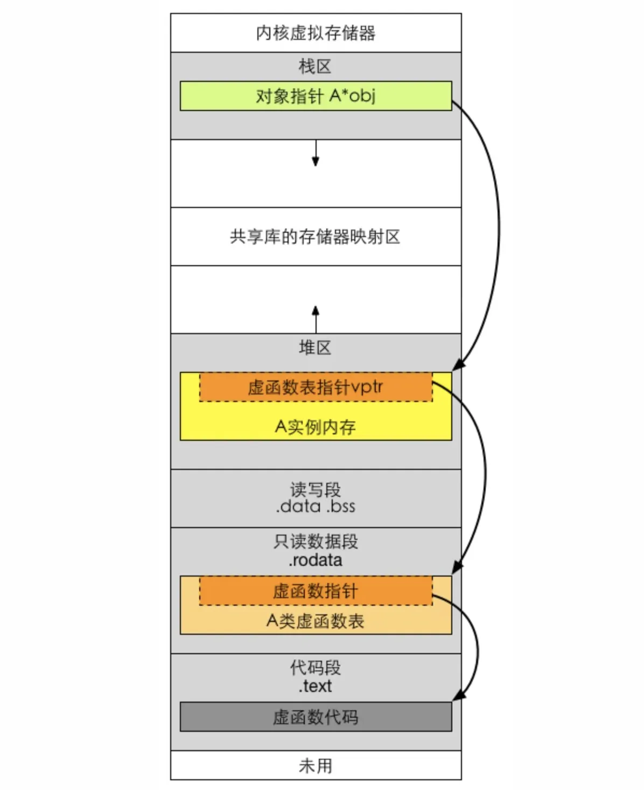

## 内存分配的形式有哪些

一个 C/C++ 编译的程序所占用的系统内存一般分为以下 5 个部分的内容：

1. 由符号起始的区块 (Block Started by Symbol)，BSS）段：BSS 段通常是指用来存放程序中**未初始化的全局数据**和**静态数据**的一块内存区域。BSS 段属于静态内存分配，程序结束后静态变量资源由系统自动释放。

2. 数据段 (data segment)：数据段通常是指用来存放程序中**已初始化的全局变量**的一块内存区域。数据段也属于静态内存分配。

3. 代码段 (code segment)/text segment()：也叫文本段，通常指用来存放程序执行代码（包括类成员函数和全局函数以及其他函数代码）的一块内存区域，这部分区域的大小**在程序运行前就已经确定**，并且代码段通常是**只读**，某些架构也允许代码段为可写，即允许修改程序。在代码段中，也有可能包含一些只读的常数变量，如**字符串常量**。这个段一般是可以被共享的，如在 Linux 系统中打开了两个 vi 来编辑文本，那么一般来说，这两个 vi 是共享一个代码段的。

4. 堆 (heap)：用于存放进程运行中被动态分配的内存段，它的大小并不固定，可动态扩张或缩减。当进程调用 malloc 或 new 等方式分配内存时，新分配的内存就被动态添加到堆上（堆被扩张），当利用 free 或 delete 等方式释放内存时，被释放的内存从堆中被删除（堆被缩减）。堆一般由程序员负责分配与释放，如果被分配的内存不能被释放，那么随着程序运行时间的增长，有可能会耗尽堆内存，从而导致程序退出或者其他意想不到的问题。需要注意的是，它与数据结构中的堆是两回事，分配方式类似于链表。

5. 栈 (stack)：用来存放程序临时创建的局部变量，一般包括函数括弧“{}”中定义的变量（但不包括 static 声明的变量，static 意味着在数据段中存放变量）。除此之外，在函数被调用时，其参数也会被压入发起调用的进程栈中，并且等到调用结束后，函数的返回值也会被存放回栈中。栈由编译器自动分配、释放，存放函数的参数值、局部变量的值等。其操作方式类似于数据结构中的栈。栈内存分配运算内置于处理器的指令集中，一般使用寄存器来存取，效率很高，但是分配的内存容量有限。

需要注意的是，代码段和数据段之间有明确的分隔，但是数据段和堆栈段之间没有，而且栈是向下增长的，堆是向上增长的。



程序示例如下：

```c++
#include <cstdlib>
#include <cstring>

int global = 0;// 全局初始化区 / 数据段
char *p1;      // 全局未初始化区 / BSS 段

int main() {
  int a;                   // 栈
  char s[] = "abc";        // 栈
  char *p2;                // 栈
  char *p3 = "123456";     // 123456\0在常量区/代码段，p3在栈上。
  static int b;            // 全局（静态）初始化区 / BSS 段
  p1 = (char *) malloc(10);// 堆区
  p2 = (char *) malloc(20);// 堆区
  strcpy(p1, "123456");    // 123456\0放在常量区，编译器可能会将它与p3所指向的"123456"优化成一个地方。
  return 0;
}
```

除了全局静态对象，还有局部静态对象和类的静态成员。局部静态对象是在函数中定义的，就像栈对象一样，只不过，其前面多了 static 关键字。局部静态对象的生命期是从其所在函数第一次被调用开始，更确切地说，是当第一次执行到该静态对象的声明代码时，产生该静态局部对象，直到整个程序结束时，才销毁该对象。类的静态成员的生命周期是该类的第一次调用到程序的结束。

## 什么是内存泄漏

堆是动态分配内存的，并且可以分配使用很大的内存，使用不好会产生内存泄漏。频繁地使用 malloc 和 free 也会产生内存碎片（类似磁盘碎片）。

所谓内存泄漏（memory leak），是指由于疏忽或错误造成程序未能释放已经不再使用的内存的情况。一般常说的内存泄漏是指堆内存的泄漏，内存泄漏其实并非指内存在物理上的消失，而是应用程序分配某段内存后，由于设计错误，失去了对该段内存的控制，因而造成了内存的浪费。

应用程序一般使用 malloc、calloc、realloc、new 等函数从堆中分配到一块内存，使用完后，程序必须负责相应地调用 free 或 delete 释放该内存块，否则这块内存就不能被再次使用，造成内存泄漏。

例如，对指针进行重新赋值，程序代码如下：

```c++
char*memoryArea=malloc(10);
char*newArea=malloc(10);
memoryArea=newArea;
```

对 memoryArea 的赋值会导致 memoryArea 之前指向的内存没有被释放，而且此时并没有变量来存储之前申请的空间的地址，因此也就没办法释放这块内存，最终造成内存泄漏。在这种情况下，虽然这块内存不再被使用了，但是由于没有被释放，因此还被标记为使用状态，无法被其他程序使用。

内存泄漏往往会导致系统出现内存资源耗尽的严重后果，用 malloc 或 new 分配的内存都应当在适当的时机用 free 或 delete 释放，在对指针赋值前，要确保没有内存位置会变为孤立的。每当释放结构化的元素，而该元素又包含指向动态分配的内存位置的指针时，都应首先遍历子内存位置并从那里开始释放，然后再遍历回父结点，始终正确处理返回动态分配的内存引用的函数返回值。

## 如何通过自定义函数的方法检测内存泄漏

一种简单的方法：在申请内存的时候，把申请内存所在的文件名以及代码行号和申请出来的内存空间的地址记录下来，当内存释放的时候，把记录下来的信息删除掉。当程序运行结束的时候，把没有释放的内存信息打印出来就可以知道代码中内存泄漏的地方了。

这种方法对于一个新开发的项目来说比较实用，但是对于一个已经存在很多年而且代码量非常大的项目来说却不是一个很好的方法，下面介绍另外一种通过拦截系统调用 malloc/free 来检测内存泄漏的方法。

通过自定义内存申请和释放的方法 mymalloc 和 myfree，然后设置一个钩子，让用户在调用 malloc/free 的时候会调用自定义的 myalloc/free 函数，然后通过下面的宏定义实现当 malloc 被调用的时候就会默认调用 mymalloc 函数的功能。

```c++
#define malloc(size) mymalloc(size, __FILE__,__LINE__)
```

需要注意的是，在调用 `mymalloc` 的时候多传入了 `__FILE__` 和  `__LINE__` 两个参数，它们分别表示调用 `mymalloc` 的代码所在的文件以及行号。有了这些信息以后，主要的实现方法为：

自定义一个列表，每当 malloc 函数被调用的时候，mymalloc 会被调用，mymalloc 函数首先通过调用系统函数 malloc 把内存申请好，然后把调用者的信息（调用者所在的文件和行号）以及申请好内存的信息添加到列表中；当 myfree 被调用的时候，首先通过调用系统函数 free 释放的对应的内存，然后根据待释放的内存地址在列表中删除记录这块内存申请的信息。

## 栈空间的最大值是多少

在 Windows 下，栈是向低地址扩展的数据结构，是一块连续的内存的区域。栈顶的地址和栈的最大容量是系统预先规定好的，在 Windows 下，栈的大小是 2MB。而申请堆空间的大小一般小于 2GB。

由于内存的读取速度比硬盘快，当程序遇到大规模数据的频繁存取时，开辟大的内存空间能显著提高效率。栈的速度快，但是空间小，不灵活。栈是向低地址扩展的数据结构，是一块连续的内存区域。而堆空间却是不连续的，原因在于系统用链表来存储空闲内存地址，所以自然是不连续的，而链表的遍历方向是由低地址向高地址。而栈的大小受限于计算机系统中有效的虚拟内存，所以堆获得的空间比较灵活，也比较大，但是速度相对慢。堆是人为控制的，所以容易产生内存泄漏问题。

Linux 默认栈空间大小为 8MB，通过命令 ulimit-s 来设置。

## 什么是缓冲区溢出

缓冲区是程序运行的时候机器内存中的一个连续块，它保存了给定类型的数据。缓冲区溢出是指当向缓冲区内填充数据位数超过了缓冲区自身的容量限制时，发生的溢出的数据覆盖在合法数据（如数据、下一条指令的指针、函数返回地址等）上的情况。最好的情况是程序不允许输入超过缓冲区长度的字符并检查数据长度，由于大多数程序都会假设数据长度总是与所分配的储存空间相当，进而存在缓冲区溢出安全隐患。

人为的缓冲区溢出一般是由于攻击者写一个超过缓冲区长度的字符串植入到缓冲区，然后再向一个有限空间的缓冲区中植入超长的字符串，这时可能会出现两个结果：一是过长的字符串覆盖了相邻的存储单元，引起程序运行失败，严重的可导致系统崩溃；另一个结果就是利用这种漏洞执行任意指令，甚至取得系统 root 特级权限，进而危害系统安全。

防止利用缓冲区溢出发起的攻击，关键在于程序开发者在开发程序时仔细检查溢出情况，不允许数据溢出缓冲区。

```c++

```
